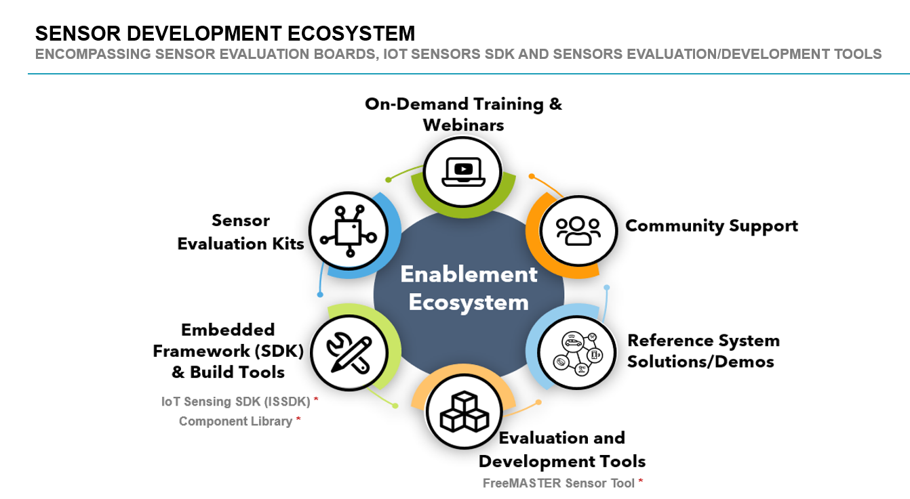
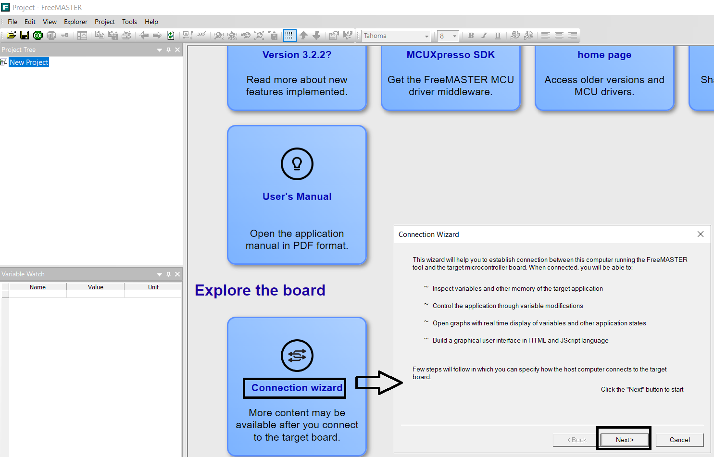
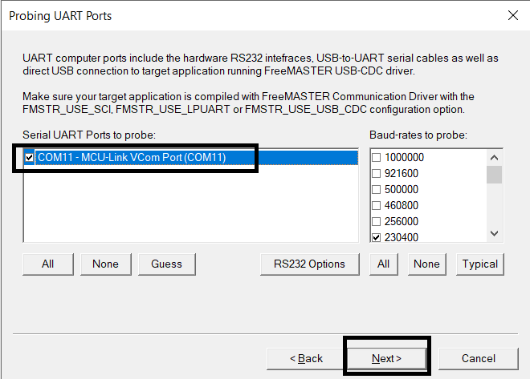
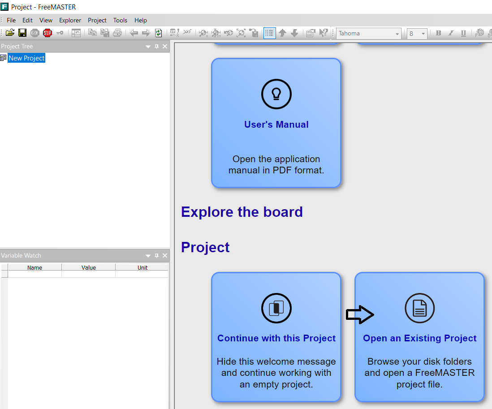
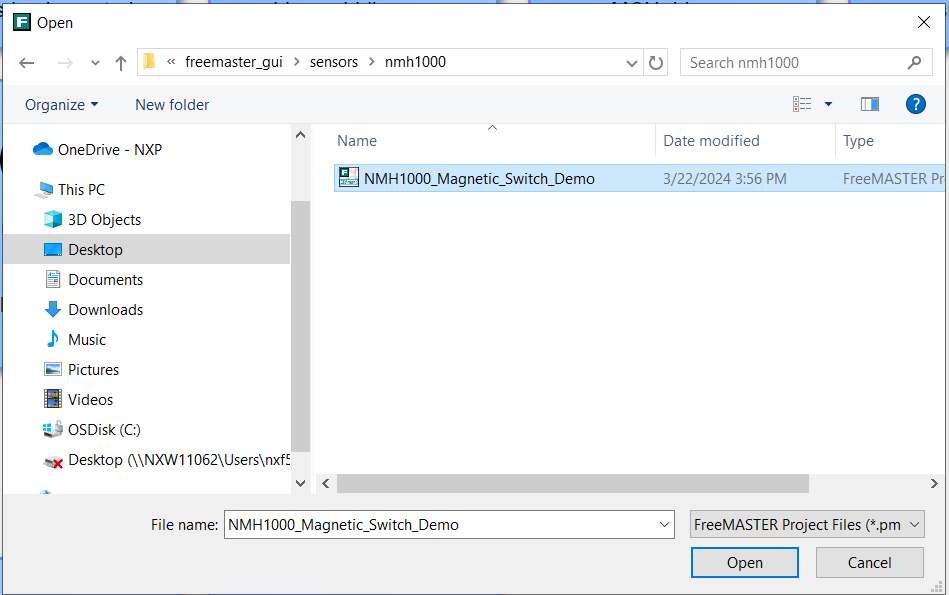
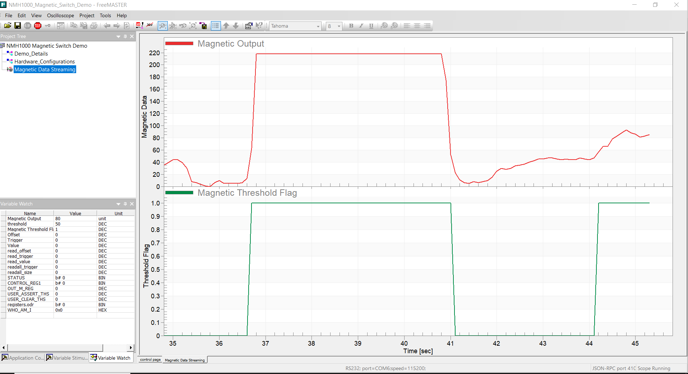
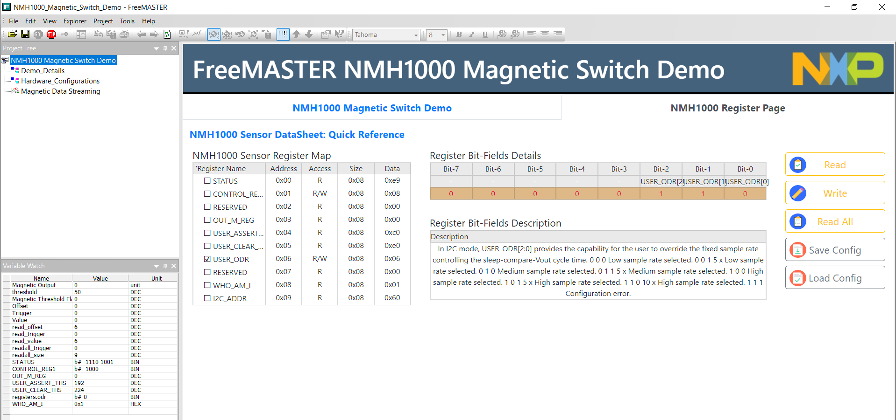

# NXP Application Code Hub

## NMH1000 magnetic switch sensor evaluation GUI using ISSDK and FreeMASTER

This example demonstrates combining ISSDK and FreeMASTER to create NMH1000 magnetic switch evaluation GUI for our customer to evaluate this sensor using sensor development tools with sensor expansion boards. 

- NXP's next-generation sensors feature a strong balance of intelligent integration, logic and customizable platform software to enable smarter, more differentiated applications.

- Easy enablement is of utmost importance to reduce evaluation, development & time to market. NXP's Sensor development ecosystem is making it easier for customers to accelerate their sensor product development.

- The image below shows Sensors Development Ecosystem Offering:

    

- NMH1000 is an ultra-low power monolithic Hall effect magnetic field sensor that provides a small footprint in low-current and low-operating-voltage, I2C mode or standalone mode. This magnetic switch sensor triggers an output when surrounding magnetic field is greater than the user-defined detection threshold.

- Please refer to NMH1000 Magnetic Switch Sensor Datasheet for more information.  
  https://www.nxp.com/docs/en/data-sheet/NMH1000.pdf

#### Boards: FRDM-MCXN947, FRDM-MCXA153
#### Accessories: mikroe_hall_switch_3_click
#### Categories: Low Power, Sensor, Tools
#### Peripherals: I2C, UART
#### Toolchains: MCUXpresso IDE

## Table of Contents
1. [Software](#step1)
2. [Hardware](#step2)
3. [Setup](#step3)
4. [Run Example Projects](#step4)
5. [Run FreeMASTER GUI](#step5)
6. [Support](#step6)

## 1. Software
- [IoT Sensing SDK (ISSDK) v1.8](https://nxp.com/iot-sensing-sdk) offered as middleware in MCUXpresso SDK for supported platforms
- [MCXUpresso SDK 2.14.0 for FRDM-MCXN947](https://mcuxpresso.nxp.com/en/builder?hw=FRDM-MCXN947)
- [MCUXPresso SDK 2.14.2 for FRDM-MCXA153](https://mcuxpresso.nxp.com/en/builder?hw=FRDM-MCXA153)
- [MCUXpresso IDE v11.9.0 or later](https://www.nxp.com/design/design-center/software/development-software/mcuxpresso-software-and-tools-/mcuxpresso-integrated-development-environment-ide:MCUXpresso-IDE)
- FreeMASTER v3.2.2 or later
- Git v2.39.0

## 2. Hardware
- [FRDM-MCXN947 MCU board](https://www.nxp.com/part/FRDM-MCXN947)
- [FRDM-MCXA153 MCU board](https://www.nxp.com/part/FRDM-MCXA153)
- Hall Switch 3 click board (https://www.mikroe.com/hall-switch-3-click)
- Personal Computer
- Mini/micro C USB cable

## 3. Setup

### 3.1 Step 1: Download and Install required Software(s)
- Download [MCUXpresso IDE 2.19.0 or newer](https://www.nxp.com/design/design-center/software/development-software/mcuxpresso-software-and-tools-/mcuxpresso-integrated-development-environment-ide:MCUXpresso-IDE?&tid=vanMCUXPRESSO/IDE) and Install following the installer instructions.
- Download [MCXUpresso SDK 2.14.0 for FRDM-MCXN947](https://mcuxpresso.nxp.com/en/builder?hw=FRDM-MCXN947). Make sure to select ISSDK and FreeMASTER middleware while building SDK.
- Install Git v2.39.0 (for cloning and running west commands)
- Download [FreeMASTER v3.2.2 or newer](https://www.nxp.com/webapp/sps/download/license.jsp?colCode=FMASTERSW32&appType=file1&DOWNLOAD_ID=null) and install following the installer instructions.

### 3.2 Step 2: Clone the APP-CODE-HUB/dm-freemaster_fxls89xxxf_evaluation_gui
- Clone this repository to get the example projects:
- Change directory to cloned project folder: 
    cd *dm-freemaster-nmh1000-evaluation-gui-firmware*

### 3.3 Step 3: Build example projects
- Open MCUXpresso IDE and select a directory to create your workspace.
- Install "MCXUpresso SDK 2.14.0 for FRDM-MCXN947" (drag and drop SDK zip into "Installed SDK" view) into MCUXpresso IDE.
- Install MCXUpresso SDK 2.14.2 for FRDM-MCXA153 (drag and drop SDK zip into "Installed SDK" view) into MCUXpresso IDE.
- Go to "Quickstart Panel" and click on "Import Project(s) from file system",
- Select "Project directory (unpacked)" and browse to the cloned project folder.
- Select example projects that you want to open and run.
- Right click on project and select build to start building the project.

## 4. Run Example Projects
- Connect the chosen example project HWs:
  FRDM-MCXN947 with Hall Switch 3 click board or
  FRDM-MCXA153 with Hall Switch 3 click board
- Right click on project and select "Debug As". Select MCUXpresso IDE LinkServer (inc. CMSIS DAP) probes.
- Connect a USB cable between the host PC and the MCU-Link USB port on the target board.
- Either press the reset button on your board or launch the debugger in your IDE to begin running the demo.

## 5. Run FreeMASTER GUI
- Launch FreeMASTER application installed on your Windows PC.
- Click on "Connection Wizard" and select Next>.  
 
- Select "Use direct connection to on board USB port" and click Next>.
- The FreeMASTER tool detects the COM port (Select the identified COM port on next screen) with the configured baud-rate automatically. Confirm the COM port and baud-rate, click "Next>".  
 
- FreeMASTER detects the board connection and will ask to confirm the detected settings. Confirm by selecting "Yes" and click "Finish".
- FreeMASTER opens an option to "Open an Existing Project". Select the option.  
 
- Browse to "<dm-freemaster-nmh1000-evaluation-gui-firmware\nmh1000_evaluation_gui\freemaster_gui/sensors/nmh1000 folder
- Select "NMH1000_Magnetic_Switch_Demo.pmpx" sensor demo project. Click "Open".  
 
- FreeMASTER launches the NMH1000 sensor demo. Click on "Magnetic Data Streaming" to visualize the current magnetic strenght reading and magnetic event status. Apply a magnetic field greater than threshold value and check whether Mag event is raised.  
 
- Click "NMH1000 Register Page" tab to access the NMH1000 register set. Click "Read All" to view instantaneous values of the NMH1000 sensor registers in real time.  
 
- Users can select specific registers and perform single register read or write actions in real time. For a chosen sensor register with read/write access, users can toggle bitfields to change the register value and click "Write" to perform register write operation and/or perform register read by clicking "Read".  
 

## 6. Support
- Reach out to NXP Sensors Community page for more support - [NXP Community](https://community.nxp.com/t5/forums/postpage/choose-node/true?_gl=1*fxvsn4*_ga*MTg2MDYwNjMzMy4xNzAyNDE4NzM0*_ga_WM5LE0KMSH*MTcwMjQxODczMy4xLjEuMTcwMjQxODczNi4wLjAuMA..)
- Learn more about NMH1000 ultra-low power mangetic switch, refer to - [NMH1000 DS](https://www.nxp.com/docs/en/data-sheet/NMH1000.pdf)
- Accelerate your sensors development using Sensor ToolBox, refer to - [Sensors Development Ecosystem](https://www.nxp.com/design/design-center/software/sensor-toolbox:SENSOR-TOOLBOXX)

#### Project Metadata
<!----- Boards ----->
 

<!----- Categories ----->
 

<!----- Peripherals ----->
 

<!----- Toolchains ----->

Questions regarding the content/correctness of this example can be entered as Issues within this GitHub repository.

>**Warning**: For more general technical questions regarding NXP Microcontrollers and the difference in expected funcionality, enter your questions on the [NXP Community Forum](https://community.nxp.com/)

## 7. Release Notes
| Version | Description / Update                           | Date                        |
|:-------:|------------------------------------------------|----------------------------:|
| 1.0     | Initial release on Application Code Hub        | May 1st 2024 |

